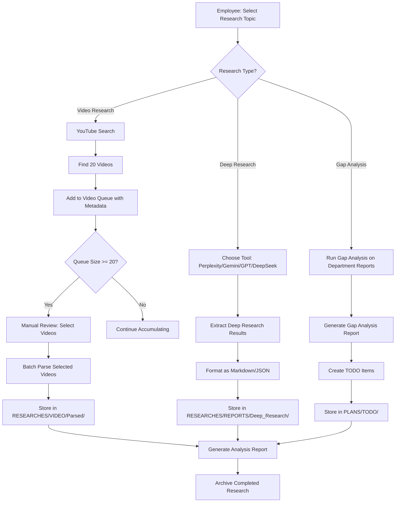

# Phase 3 Context: RESEARCHES Restructuring + Video Queue System

**Phase**: 3 of 6
**Agents**: 3 simultaneous
**Priority**: P0-CRITICAL ⚠️
**Status**: ✅ Ready to Execute
**Dependencies**: None (can execute immediately after Phase 1)
**Estimated Complexity**: High

---

## 🎯 Phase Objectives

1. **Reorganize RESEARCHES folder** - Consolidate scattered research files
2. **Build Video Queue System** - 20-video accumulation before manual review
3. **Document Research Import Flow** - YouTube → Deep Research → Queue → Task
4. **Integrate with TASK_MANAGERS** - Connect research to task execution

---

## ⚡ WHY THIS IS P0-CRITICAL

Per Russian transcript discussion:
- **Video research workflow** is immediate operational need
- **Deep Research queue (kolejka)** prevents losing research results
- **Manual approval gates** keep employees engaged ("мануально")
- **Portfolio diversity problem** requires systematic research accumulation

Current pain points:
- Deep Research results get lost (no persistent queue)
- Employees spend 10-15 min selecting from 20 videos manually each time
- Could batch 20 videos for parsing instead
- Need metadata capture: views, likes, publish_date, channel

---

## 🤖 Agent Assignments

### Agent 3A: Research Consolidation Agent
**Focus**: Organize scattered RESEARCHES folder structure
**Working Directory**: `TASK_MANAGERS/RESEARCHES/`
**Output**: Clean folder structure + research index

### Agent 3B: Video Queue System Agent (HIGHEST PRIORITY)
**Focus**: Build 20-video accumulation queue with metadata
**Working Directory**: `TASK_MANAGERS/RESEARCHES/Video_Queue/` + `TASK_MANAGERS/RESEARCHES/`
**Output**: Queue system + tracking CSV + integration docs

### Agent 3C: Research Import Flow Documentation Agent
**Focus**: Document end-to-end research workflow
**Working Directory**: `TASK_MANAGERS/RESEARCHES/` + `TASK_MANAGERS/`
**Output**: Flow documentation + integration guide

---

## 📋 Agent 3A: Research Consolidation

### Problem Statement
RESEARCHES folder structure is scattered:
```
RESEARCHES/
├── REPORTS/Weekly_Analysis/ (weekly research phases)
├── 24/ (current research batch Nov 22)
├── INDEXES/ (research indexes)
├── LOGS/ (research session logs)
├── RESEARCH_PROMPTS/ (research prompt templates)
├── Research_Reports/ (completed research outputs)
├── TAXONOMY/ (research taxonomy definitions)
├── RESEARCHES/ (video processing research)
└── RESEARCHES/Video_Queue/ (video processing queue) ← Should move to TASK_MANAGERS
```

Need clear structure that separates:
- **Active research** (current batches)
- **Completed research** (archived reports)
- **Research infrastructure** (prompts, taxonomy, logs)
- **Video-specific research** (own sub-system)

### Task Instructions

#### Step 1: Inventory Current RESEARCHES Structure
Scan all folders and files in `TASK_MANAGERS/RESEARCHES/`:
- Catalog folder structure (all subdirectories)
- Count files per folder
- Identify file types (MD, CSV, JSON, etc.)
- Note creation/modification dates
- Identify orphaned or misplaced files

Output: `RESEARCHES_Structure_Inventory.csv`

Format:
```csv
Folder_Path,File_Count,File_Types,Oldest_File_Date,Newest_File_Date,Total_Size_MB,Category,Recommended_Location
RESEARCHES/24/,15,"MD,JSON",2025-11-22,2025-11-22,2.3,Active,Keep
RESEARCHES/LOGS/,47,MD,2025-10-01,2025-11-21,8.7,Infrastructure,Move to LOG/
```

#### Step 2: Create Proposed Structure
Design new RESEARCHES folder structure:

```
RESEARCHES/
├── ACTIVE/ ← NEW: Current research batches
│   ├── 2025-11-22/ (today's batch, was "24")
│   ├── 2025-11-21/
│   └── README.md
├── ARCHIVE/ ← NEW: Completed research by date
│   ├── 2025-11/ (November 2025 completed research)
│   ├── 2025-10/
│   └── README.md
├── INFRASTRUCTURE/ ← NEW: Research support files
│   ├── PROMPTS/ (research prompts, was RESEARCH_PROMPTS)
│   ├── TAXONOMY/ (research taxonomy)
│   ├── INDEXES/ (research indexes)
│   └── README.md
├── REPORTS/ ← RENAMED: Was Research_Reports
│   ├── Weekly/ (weekly analysis reports)
│   ├── Deep_Research/ (deep research outputs)
│   ├── Gap_Analysis/ (gap analysis reports)
│   └── README.md
├── VIDEO/ ← CONSOLIDATED: All video research
│   ├── Queue/ (video queue system - integrated with TSM-008)
│   ├── Parsed/ (parsed video transcripts)
│   ├── Analysis/ (video analysis reports)
│   └── README.md
└── README.md (master RESEARCHES overview)
```

Document in: `RESEARCHES_Proposed_Structure.md`

#### Step 3: Create Migration Map
For each file/folder in current structure, specify:
- Current location
- Proposed new location
- Migration action (MOVE, RENAME, ARCHIVE, DELETE)
- Dependencies (files that reference this)
- Priority (P0-P3)

Output: `RESEARCHES_Migration_Map.csv`

Format:
```csv
Current_Path,Proposed_Path,Action,Dependencies,Priority,Notes
RESEARCHES/24/,RESEARCHES/ACTIVE/2025-11-22/,MOVE,None,P0,Current batch
RESEARCHES/LOGS/,LOG/Researches/,MOVE,Research scripts,P1,Consolidate logs
RESEARCHES/RESEARCHES/Video_Queue/,TASK_MANAGERS/RESEARCHES/Video_Queue/,VERIFY,Agent 3B,P0,Check if already moved
```

#### Step 4: Migrate to New Structure (Careful Execution)
Execute migration in priority order:
1. **P0 items first** - Critical active research
2. **P1 items second** - Infrastructure files
3. **P2 items third** - Archive files
4. **P3 items last** - Optional cleanup

For each migration:
- Create destination folder if doesn't exist
- Copy file to new location FIRST (don't move yet)
- Verify copy successful
- Update any references in other files
- Delete original (only after verification)
- Log in migration log

Output: `RESEARCHES_Migration_Log.csv`

Format:
```csv
Timestamp,Source_Path,Destination_Path,Action,Status,File_Size,Verification_Hash,Notes
2025-11-22 10:15:23,RESEARCHES/24/,RESEARCHES/ACTIVE/2025-11-22/,MOVE,SUCCESS,2.3MB,abc123,15 files moved
```

#### Step 5: Create README Files
Generate README.md for each major folder:

**RESEARCHES/README.md** (Master overview):
```markdown
# RESEARCHES Entity

## Purpose
Central repository for all research activities, from initial topic selection through completed reports.

## Structure
- **ACTIVE/** - Current research batches (organized by date)
- **ARCHIVE/** - Completed research (organized by month)
- **INFRASTRUCTURE/** - Prompts, taxonomy, indexes
- **REPORTS/** - Published research reports (weekly, deep research, gap analysis)
- **VIDEO/** - Video research subsystem (queue, parsing, analysis)

## Workflow
See: [Research_Import_Flow.md](./Research_Import_Flow.md) (created by Agent 3C)

## Last Updated
2025-11-22 - Phase 3 restructuring

## Related Entities
- TASK_MANAGERS/RESEARCHES/Video_Queue/ (video queue system)
- PROMPTS/DEPARTMENTS/Research/ (research prompts)
- LOG/Researches/ (research session logs)
```

Create similar READMEs for:
- `TASK_MANAGERS/RESEARCHES/ACTIVE/README.md`
- `TASK_MANAGERS/RESEARCHES/ARCHIVE/README.md`
- `TASK_MANAGERS/RESEARCHES/INFRASTRUCTURE/README.md`
- `TASK_MANAGERS/RESEARCHES/REPORTS/README.md`
- `TASK_MANAGERS/RESEARCHES/VIDEO/README.md`

#### Step 6: Update Cross-References
Scan these locations for references to old RESEARCHES paths:
- `PROMPTS/` (research prompt files)
- `TASK_MANAGERS/` (task templates referencing research)
- `DAILIES/` (recent daily reports)
- `PLANS/` (plan documents)
- `Scripts/` (processing scripts)

Update paths to new structure.

Output: `RESEARCHES_Cross_Reference_Updates.csv`

### Input Files
```
RESEARCHES/ (entire folder tree)
PROMPTS/**/* (for cross-reference scanning)
TASK_MANAGERS/**/* (for cross-reference scanning)
DAILIES/**/* (for cross-reference scanning)
Scripts/**/* (for cross-reference scanning)
```

### Output Files
```
RESEARCHES/ (restructured with new folder hierarchy)
├── ACTIVE/
├── ARCHIVE/
├── INFRASTRUCTURE/
├── REPORTS/
├── VIDEO/
└── README.md (+ READMEs in subfolders)

REPORTS/2025-11-22/System_Rebuild/
├── Phase_3A_RESEARCHES_Structure_Inventory.csv
├── Phase_3A_RESEARCHES_Proposed_Structure.md
├── Phase_3A_RESEARCHES_Migration_Map.csv
├── Phase_3A_RESEARCHES_Migration_Log.csv
└── Phase_3A_RESEARCHES_Cross_Reference_Updates.csv
```

### Success Criteria
- [ ] All RESEARCHES files inventoried (counts match file system)
- [ ] New structure proposed and documented
- [ ] Migration map created (all files accounted for)
- [ ] Migration executed successfully (verification hashes match)
- [ ] READMEs created for all major folders
- [ ] Cross-references updated (no broken paths)
- [ ] RESEARCHES folder clean and navigable

---

## 📋 Agent 3B: Video Queue System (PRIORITY)

### Problem Statement
Per Russian transcript:
- Employees do Deep Research, find 20 videos
- Spend 10-15 min manually selecting 1 video from 20
- Those 20 videos get lost (no accumulation)
- Could batch-parse all 20 instead
- Need metadata: views, likes, publish_date, channel

**Goal**: Build queue system that:
1. Accumulates up to 20 videos before requiring manual review
2. Captures metadata for each video
3. Allows employee to see queue and select videos
4. Integrates with video parsing workflow
5. Exports to multiple formats (MD table, JSON, CSV)

### Task Instructions

#### Step 1: Analyze Existing RESEARCHES/Video_Queue
Scan `TASK_MANAGERS/RESEARCHES/Video_Queue/` or `TASK_MANAGERS/RESEARCHES/RESEARCHES/Video_Queue/`:
- Current structure
- Existing files (if any)
- Any existing queue tracking system
- Integration with other systems

Output: `TSM-008_Current_State_Analysis.md`

#### Step 2: Design Video Queue System

**Core Components**:

1. **Queue Tracking CSV**: `Video_Queue_Master.csv`
```csv
Queue_ID,Video_ID,Video_Title,Channel_Name,Channel_URL,Video_URL,Views,Likes,Comments,Publish_Date,Duration,Added_By,Added_Date,Status,Selected_By,Selected_Date,Parsed_Date,Topic_Category,Research_Source,Priority_Score,Notes
VQ-001,dQw4w9WgXcQ,Example Video,Example Channel,https://...,https://youtube.com/...,1500000,45000,2300,2025-10-15,00:10:32,Niko Kar,2025-11-22,Pending,,,Design Research,Perplexity,75,Found via Deep Research on UI trends
VQ-002,aBc123DeF45,Another Video,Tech Channel,https://...,https://youtube.com/...,850000,32000,1800,2025-11-01,00:08:15,Employee2,2025-11-22,Pending,,,Video Editing,Gemini,65,Tutorial on effects
```

**Fields**:
- `Queue_ID`: VQ-001, VQ-002, etc. (auto-increment)
- `Video_ID`: YouTube video ID (extracted from URL)
- `Video_Title`: Full video title
- `Channel_Name`: YouTube channel name
- `Channel_URL`: Channel URL
- `Video_URL`: Full YouTube video URL
- `Views`: View count (numeric)
- `Likes`: Like count (numeric)
- `Comments`: Comment count (numeric)
- `Publish_Date`: Video publication date (YYYY-MM-DD)
- `Duration`: Video length (HH:MM:SS)
- `Added_By`: Employee who added to queue
- `Added_Date`: Date added to queue (YYYY-MM-DD)
- `Status`: Pending | Selected | Parsing | Parsed | Rejected
- `Selected_By`: Employee who selected for parsing
- `Selected_Date`: Date selected
- `Parsed_Date`: Date parsing completed
- `Topic_Category`: Research topic (Design Research, Video Editing, etc.)
- `Research_Source`: Tool used (Perplexity, Gemini, GPT, DeepSeek, YouTube)
- `Priority_Score`: 0-100 (calculated from views, likes, recency)
- `Notes`: Free text notes

2. **Queue Dashboard (HTML)**: `Video_Queue_Dashboard.html`
- Shows all videos in queue
- Sortable by: priority, date added, views, likes
- Filterable by: status, topic, research source, employee
- Export buttons: CSV, JSON, Markdown
- Action buttons: Select for parsing, Reject, Move to top

3. **Queue Management Scripts**:
- `add_video_to_queue.py` - Add video with metadata extraction
- `update_queue_status.py` - Update video status
- `export_queue.py` - Export queue to formats
- `calculate_priority.py` - Calculate priority scores

4. **Integration Files**:
- `Queue_Integration_Guide.md` - How to integrate with Deep Research workflow
- `API_Documentation.md` - If building API endpoints
- `Workflow_Diagram.md` - Visual workflow documentation

#### Step 3: Implement Queue System

**Sub-step 3.1**: Create TASK_MANAGERS/RESEARCHES/Video_Queue/ structure
```
TASK_MANAGERS/RESEARCHES/Video_Queue/
├── Video_Queue_Master.csv (main queue tracking)
├── Video_Queue_Dashboard.html (employee interface)
├── scripts/
│   ├── add_video_to_queue.py
│   ├── update_queue_status.py
│   ├── export_queue.py
│   └── calculate_priority.py
├── docs/
│   ├── Queue_Integration_Guide.md
│   ├── API_Documentation.md
│   └── Workflow_Diagram.md
├── exports/ (generated exports)
│   ├── queue_export_YYYY-MM-DD.csv
│   ├── queue_export_YYYY-MM-DD.json
│   └── queue_export_YYYY-MM-DD.md
├── archive/ (archived queues)
│   └── queue_archive_YYYY-MM.csv
└── README.md
```

**Sub-step 3.2**: Implement Priority Scoring Algorithm
```python
def calculate_priority_score(video_metadata):
    """
    Calculate priority score 0-100 based on:
    - Views (30% weight) - normalized to 0-30
    - Likes (20% weight) - normalized to 0-20
    - Recency (30% weight) - newer = higher score
    - Engagement rate (20% weight) - likes/views ratio
    """
    views_score = min(30, (video_metadata['views'] / 1000000) * 30)  # 1M views = max
    likes_score = min(20, (video_metadata['likes'] / 50000) * 20)  # 50K likes = max

    days_since_publish = (datetime.now() - video_metadata['publish_date']).days
    recency_score = max(0, 30 - (days_since_publish / 30))  # 30 points for brand new, 0 after 30 days

    engagement_rate = video_metadata['likes'] / max(1, video_metadata['views'])
    engagement_score = min(20, engagement_rate * 2000)  # 1% engagement = 20 points

    total_score = views_score + likes_score + recency_score + engagement_score
    return round(total_score, 2)
```

Document in: `scripts/calculate_priority.py`

**Sub-step 3.3**: Create Add Video Script
```python
# add_video_to_queue.py
import pandas as pd
from datetime import datetime
import re

def extract_video_id(url):
    """Extract YouTube video ID from URL"""
    patterns = [
        r'(?:youtube\.com\/watch\?v=|youtu\.be\/)([a-zA-Z0-9_-]{11})',
    ]
    for pattern in patterns:
        match = re.search(pattern, url)
        if match:
            return match.group(1)
    return None

def add_video(video_url, added_by, topic_category, research_source, notes=""):
    """
    Add video to queue with metadata extraction

    Args:
        video_url: YouTube video URL
        added_by: Employee name
        topic_category: Research topic
        research_source: Tool used (Perplexity, Gemini, etc.)
        notes: Optional notes

    Returns:
        Queue ID assigned
    """
    # Extract video ID
    video_id = extract_video_id(video_url)

    # TODO: Extract metadata using YouTube API or web scraping
    # For now, placeholder structure
    metadata = {
        'video_id': video_id,
        'video_title': '[To be extracted]',
        'channel_name': '[To be extracted]',
        'channel_url': '[To be extracted]',
        'video_url': video_url,
        'views': 0,  # Extract from YouTube
        'likes': 0,  # Extract from YouTube
        'comments': 0,  # Extract from YouTube
        'publish_date': datetime.now().strftime('%Y-%m-%d'),  # Extract from YouTube
        'duration': '00:00:00',  # Extract from YouTube
        'added_by': added_by,
        'added_date': datetime.now().strftime('%Y-%m-%d'),
        'status': 'Pending',
        'selected_by': '',
        'selected_date': '',
        'parsed_date': '',
        'topic_category': topic_category,
        'research_source': research_source,
        'priority_score': 0,  # Calculate after metadata extracted
        'notes': notes
    }

    # Load queue CSV
    queue_df = pd.read_csv('Video_Queue_Master.csv')

    # Generate Queue ID
    last_id = queue_df['Queue_ID'].max() if not queue_df.empty else 'VQ-000'
    new_id_num = int(last_id.split('-')[1]) + 1
    queue_id = f'VQ-{new_id_num:03d}'

    metadata['queue_id'] = queue_id

    # Add to queue
    queue_df = pd.concat([queue_df, pd.DataFrame([metadata])], ignore_index=True)
    queue_df.to_csv('Video_Queue_Master.csv', index=False)

    print(f"✅ Video added to queue: {queue_id}")
    return queue_id

# CLI interface
if __name__ == '__main__':
    import sys
    if len(sys.argv) < 5:
        print("Usage: python add_video_to_queue.py <video_url> <added_by> <topic> <source> [notes]")
        sys.exit(1)

    video_url = sys.argv[1]
    added_by = sys.argv[2]
    topic = sys.argv[3]
    source = sys.argv[4]
    notes = sys.argv[5] if len(sys.argv) > 5 else ""

    add_video(video_url, added_by, topic, source, notes)
```

**Sub-step 3.4**: Create Queue Dashboard HTML
```html
<!DOCTYPE html>
<html>
<head>
    <title>Video Research Queue Dashboard</title>
    <style>
        body { font-family: Arial, sans-serif; margin: 20px; }
        table { border-collapse: collapse; width: 100%; margin-top: 20px; }
        th, td { border: 1px solid #ddd; padding: 8px; text-align: left; }
        th { background-color: #4CAF50; color: white; }
        tr:hover { background-color: #f5f5f5; }
        .filters { margin: 20px 0; }
        .filters label { margin-right: 10px; }
        .status-pending { background-color: #fff3cd; }
        .status-selected { background-color: #d1ecf1; }
        .status-parsed { background-color: #d4edda; }
        .priority-high { font-weight: bold; color: #d9534f; }
        .priority-medium { color: #f0ad4e; }
        .priority-low { color: #5bc0de; }
    </style>
</head>
<body>
    <h1>Video Research Queue Dashboard</h1>
    <p>Total videos in queue: <span id="total-count">0</span> | Pending: <span id="pending-count">0</span> | Selected: <span id="selected-count">0</span> | Parsed: <span id="parsed-count">0</span></p>

    <div class="filters">
        <label>Filter by Status:
            <select id="filter-status">
                <option value="">All</option>
                <option value="Pending">Pending</option>
                <option value="Selected">Selected</option>
                <option value="Parsing">Parsing</option>
                <option value="Parsed">Parsed</option>
                <option value="Rejected">Rejected</option>
            </select>
        </label>

        <label>Filter by Topic:
            <select id="filter-topic">
                <option value="">All</option>
                <!-- Populated dynamically -->
            </select>
        </label>

        <label>Filter by Source:
            <select id="filter-source">
                <option value="">All</option>
                <option value="Perplexity">Perplexity</option>
                <option value="Gemini">Gemini</option>
                <option value="GPT">GPT</option>
                <option value="DeepSeek">DeepSeek</option>
                <option value="YouTube">YouTube</option>
            </select>
        </label>

        <label>Sort by:
            <select id="sort-by">
                <option value="priority_score">Priority (High to Low)</option>
                <option value="added_date">Date Added (Newest)</option>
                <option value="views">Views (Most)</option>
                <option value="likes">Likes (Most)</option>
            </select>
        </label>

        <button onclick="exportToCSV()">Export to CSV</button>
        <button onclick="exportToJSON()">Export to JSON</button>
        <button onclick="exportToMarkdown()">Export to Markdown</button>
    </div>

    <table id="queue-table">
        <thead>
            <tr>
                <th>Queue ID</th>
                <th>Video Title</th>
                <th>Channel</th>
                <th>Views</th>
                <th>Likes</th>
                <th>Published</th>
                <th>Topic</th>
                <th>Source</th>
                <th>Priority</th>
                <th>Status</th>
                <th>Added By</th>
                <th>Actions</th>
            </tr>
        </thead>
        <tbody id="queue-tbody">
            <!-- Populated dynamically from Video_Queue_Master.csv -->
        </tbody>
    </table>

    <script>
        // JavaScript to load Video_Queue_Master.csv and populate table
        // Add filtering, sorting, export functionality
        // TODO: Implement
    </script>
</body>
</html>
```

#### Step 4: Create Integration Documentation

**Queue_Integration_Guide.md**:
```markdown
# Video Queue Integration Guide

## Overview
The Video Queue System accumulates up to 20 videos before requiring manual review, solving the problem of lost Deep Research results.

## Workflow Integration

### Step 1: Employee Does Deep Research
Employee uses Deep Research tool (Perplexity, Gemini, GPT, DeepSeek) to find videos on a topic.

### Step 2: Add Videos to Queue
For each video found:
```bash
python add_video_to_queue.py \
    "https://youtube.com/watch?v=..." \
    "Niko Kar" \
    "Design Research" \
    "Perplexity" \
    "Found via UI trends research"
```

Or use web interface (TBD).

### Step 3: Queue Accumulation
Videos accumulate in queue. No manual review required until:
- 20 videos reached, OR
- Employee explicitly requests review

### Step 4: Employee Reviews Queue
Employee opens `Video_Queue_Dashboard.html` and:
- Filters by topic/source
- Sorts by priority
- Selects videos for parsing
- Updates status to "Selected"

### Step 5: Batch Parsing
All selected videos parsed in batch (saves time vs manual one-by-one).

### Step 6: Archive
Once parsed, videos moved to archive. Queue resets.

## Integration Points

### With Deep Research (Phase 4)
- Deep Research task template includes "Add to video queue" step
- Prompts reference queue location
- Employee dashboard shows queue status

### With RESEARCHES Entity
- Parsed videos stored in `TASK_MANAGERS/RESEARCHES/VIDEO/Parsed/`
- Analysis reports in `TASK_MANAGERS/RESEARCHES/VIDEO/Analysis/`
- Queue references research topics from `TASK_MANAGERS/RESEARCHES/TAXONOMY/`

### With DAILIES
- Daily reports can include "Videos added to queue today: X"
- Prompts extract queue additions from daily activities

### With TASK_MANAGERS
- Queue system lives in `TASK_MANAGERS/RESEARCHES/Video_Queue/`
- Task templates reference queue for video research tasks
- Milestone templates include "Video research phase" with queue target

## Manual Approval Gates

Per user requirement ("мануально"):
- Queue does NOT auto-parse videos
- Employee must manually select from queue
- Dashboard provides interface for selection
- Keeps employee engaged in decision-making

## Expected Benefits

1. **No Lost Research**: All found videos preserved in queue
2. **Batch Efficiency**: Parse 20 videos at once vs 1 at a time
3. **Priority Intelligence**: Metadata shows best videos first
4. **Time Savings**: 10-15 min selection time → 2-3 min queue review
5. **Portfolio Diversity**: Track video sources for varied portfolio content
```

#### Step 5: Test Queue System
Create test data:
- Add 5 sample videos to queue
- Generate sample dashboard HTML with test data
- Test priority calculation with edge cases
- Verify CSV exports work
- Test filters and sorting

Output: `TSM-008_Queue_System_Test_Report.md`

### Input Files
```
TASK_MANAGERS/RESEARCHES/Video_Queue/ (if exists, otherwise create)
RESEARCHES/ (for integration context)
PROMPTS/DEPARTMENTS/Research/ (research prompts)
```

### Output Files
```
TASK_MANAGERS/RESEARCHES/Video_Queue/
├── Video_Queue_Master.csv
├── Video_Queue_Dashboard.html
├── scripts/
│   ├── add_video_to_queue.py
│   ├── update_queue_status.py
│   ├── export_queue.py
│   └── calculate_priority.py
├── docs/
│   ├── Queue_Integration_Guide.md
│   ├── API_Documentation.md
│   └── Workflow_Diagram.md
├── exports/
├── archive/
└── README.md

REPORTS/2025-11-22/System_Rebuild/
├── Phase_3B_TSM-008_Current_State_Analysis.md
├── Phase_3B_Queue_System_Design.md
├── Phase_3B_Queue_System_Test_Report.md
└── Phase_3B_Integration_Documentation.md
```

### Success Criteria
- [ ] Video Queue Master CSV created with all required fields
- [ ] Priority scoring algorithm implemented and tested
- [ ] Add video script functional (with placeholder metadata extraction)
- [ ] Queue dashboard HTML created (functional interface)
- [ ] Integration guide documented with workflow
- [ ] Test with 5 sample videos successful
- [ ] Accumulates 20 videos before requiring review
- [ ] Metadata captured: views, likes, publish_date, channel
- [ ] Exports to CSV, JSON, Markdown work

---

## 📋 Agent 3C: Research Import Flow Documentation

### Problem Statement
Need clear documentation of end-to-end research workflow:
- How to select research topics
- Which tools to use (Perplexity, Gemini, GPT, DeepSeek, YouTube)
- How results flow into queue
- How queue integrates with task execution
- How to export and archive research

### Task Instructions

#### Step 1: Map Current Research Workflow
Document existing workflow by:
- Interviewing user (via notes analysis)
- Scanning `TASK_MANAGERS/RESEARCHES/` for workflow evidence
- Reviewing `PROMPTS/DEPARTMENTS/Research/` for research prompts
- Analyzing `DAILIES/` for how employees currently do research

Output: `Current_Research_Workflow_Analysis.md`

#### Step 2: Design Ideal Research Import Flow

Create visual workflow diagram (Mermaid format):

```markdown
# Research Import Flow

## High-Level Flow


## Detailed Steps

### 1. Topic Selection
**Input**: Employee has research need (from daily tasks, manager request, or self-driven)
**Process**:
- Check `TASK_MANAGERS/RESEARCHES/TAXONOMY/Research_Topics_Master.csv` for existing topics
- Choose topic or create new topic
- Assign topic ID (RT-001, RT-002, etc.)

**Output**: Research topic registered

### 2. Tool Selection
Employee chooses research tool based on need:
- **Perplexity**: Web search + AI synthesis, good for current events
- **Gemini**: Google AI, good for technical deep dives
- **GPT**: General AI research, good for breadth
- **DeepSeek**: Specialized AI, good for depth
- **YouTube**: Video research, good for tutorials/case studies

**Prompt Reference**: `PROMPTS/DEPARTMENTS/Research/Tool_Selection_Guide.md`

### 3. Execute Research
Employee runs research using chosen tool.

**For Video Research**:
- Search YouTube for topic
- Identify 20 candidate videos
- For each video, extract metadata:
  - Title, channel, URL
  - Views, likes, comments
  - Publish date, duration
- Add to video queue using `add_video_to_queue.py`

**For Deep Research**:
- Run research in chosen tool
- Extract key findings
- Format results (Markdown or JSON)
- Save to `TASK_MANAGERS/RESEARCHES/ACTIVE/[DATE]/`

### 4. Queue Accumulation (Video Only)
Videos accumulate in `Video_Queue_Master.csv`.
No manual review until:
- 20 videos reached, OR
- Employee requests review

### 5. Manual Selection (Video Only)
Employee opens `Video_Queue_Dashboard.html`:
- Reviews accumulated videos
- Filters by topic/priority
- Selects videos for parsing (or rejects)
- Updates status to "Selected"

### 6. Batch Processing
**Video Research**:
- All selected videos parsed in batch
- Transcripts extracted
- Stored in `TASK_MANAGERS/RESEARCHES/VIDEO/Parsed/[DATE]/`

**Deep Research**:
- Results already formatted in step 3
- Move from ACTIVE to REPORTS

### 7. Analysis & Reporting
Generate analysis reports:
- Video research → `TASK_MANAGERS/RESEARCHES/VIDEO/Analysis/`
- Deep research → `TASK_MANAGERS/RESEARCHES/REPORTS/Deep_Research/`
- Gap analysis → `TASK_MANAGERS/RESEARCHES/REPORTS/Gap_Analysis/`

**Prompt Reference**: `PROMPTS/DEPARTMENTS/Research/Analysis_Report_Templates.md`

### 8. Archive
Completed research moved to:
- `TASK_MANAGERS/RESEARCHES/ARCHIVE/[YYYY-MM]/`

Maintains active research folder clean.
```

#### Step 3: Create Research Prompt Library Integration

Document how research prompts integrate with workflow:

**File**: `Research_Prompts_Integration.md`

```markdown
# Research Prompts Integration

## Available Research Prompts

From `PROMPTS/DEPARTMENTS/Research/`:
1. Deep_Research_Topic_Selection.md
2. Video_Research_Criteria.md
3. Gap_Analysis_Framework.md
4. Research_Results_Formatting.md
5. Analysis_Report_Generation.md

## Prompt Usage by Workflow Step

### Step 1: Topic Selection
**Prompt**: `Deep_Research_Topic_Selection.md`
**Purpose**: Help employee identify high-value research topics
**Input**: Department reports, task manager backlog, employee interests
**Output**: Prioritized list of research topics

### Step 2: Tool Selection
**Prompt**: `Tool_Selection_Guide.md`
**Purpose**: Match research need to best tool
**Input**: Research topic, desired output format, time available
**Output**: Recommended tool (Perplexity/Gemini/GPT/DeepSeek/YouTube)

### Step 3: Video Research Criteria
**Prompt**: `Video_Research_Criteria.md`
**Purpose**: Define what makes a good video for research
**Input**: Research topic, target audience (designers, developers, etc.)
**Output**: Criteria checklist for video selection

### Step 6: Analysis Report Generation
**Prompt**: `Analysis_Report_Generation.md`
**Purpose**: Standardize research report format
**Input**: Research results (video transcripts, deep research findings)
**Output**: Structured analysis report

## Prompt Customization

Employees can customize prompts for their department:
- Copy base prompt from `PROMPTS/DEPARTMENTS/Research/`
- Modify for department-specific needs
- Save to `PROMPTS/DEPARTMENTS/[Department]/Custom_Research_Prompts/`

## Integration with Task Templates

Research prompts referenced in task templates:
- `TASK_MANAGERS/TSM-003_Task_Templates/Task-Template-DeepResearch-001.json`
- Includes prompt IDs in task definition
- Auto-loads prompt when task created
```

#### Step 4: Create Employee Quick Start Guide

**File**: `Research_Quick_Start_Guide.md`

```markdown
# Research Quick Start Guide for Employees

## Your First Video Research

### 1. Identify Topic
What do you need to learn about today?
Example: "UI design trends 2025"

### 2. Search YouTube
Find 20 videos on your topic.

### 3. Add to Queue
For each video, run:
```bash
python TASK_MANAGERS/RESEARCHES/Video_Queue/scripts/add_video_to_queue.py \
    "https://youtube.com/watch?v=VIDEO_ID" \
    "Your Name" \
    "UI Design Trends" \
    "YouTube" \
    "Optional notes about this video"
```

### 4. Keep Working
Queue accumulates in background. No need to review until 20 videos collected.

### 5. Review Queue (When Ready)
Open `TASK_MANAGERS/RESEARCHES/Video_Queue/Video_Queue_Dashboard.html` in browser.
- Filter by your topic
- Sort by priority
- Select best videos for parsing
- Click "Mark as Selected"

### 6. Request Batch Parsing
Notify video team (or run parsing script) to parse all selected videos.

### 7. Read Parsed Results
Check `TASK_MANAGERS/RESEARCHES/VIDEO/Parsed/[TODAY'S_DATE]/` for transcripts.

### 8. Create Analysis Report
Use template: `PROMPTS/DEPARTMENTS/Research/Analysis_Report_Generation.md`
Save to: `TASK_MANAGERS/RESEARCHES/REPORTS/Deep_Research/`

## Your First Deep Research

### 1. Choose Tool
- **Perplexity**: For current trends, web search + AI
- **Gemini**: For technical depth, Google AI
- **GPT**: For broad analysis, ChatGPT
- **DeepSeek**: For specialized research

### 2. Run Research
Use tool to research your topic.
Save results as Markdown or JSON.

### 3. Save Results
`TASK_MANAGERS/RESEARCHES/ACTIVE/[TODAY'S_DATE]/[TOPIC]_Deep_Research.md`

### 4. Generate Analysis
Use prompt: `PROMPTS/DEPARTMENTS/Research/Analysis_Report_Generation.md`

### 5. Move to Reports
When complete, move to:
`TASK_MANAGERS/RESEARCHES/REPORTS/Deep_Research/[TOPIC]_Analysis_[DATE].md`

## Tips

- **Use queue system**: Don't manually select videos one-by-one
- **Batch your work**: Accumulate research, process in batches
- **Document your sources**: Always note which tool you used
- **Tag your topics**: Use consistent topic names for easier filtering
- **Review priorities**: Higher priority = better video (more views, likes, recent)
```

#### Step 5: Create System Admin Guide

**File**: `Research_System_Admin_Guide.md`

Document for system administrators:
- How to maintain queue system
- How to archive old research
- How to update prompts
- How to onboard new employees
- How to troubleshoot common issues

### Input Files
```
RESEARCHES/ (entire structure)
TASK_MANAGERS/RESEARCHES/Video_Queue/ (from Agent 3B)
PROMPTS/DEPARTMENTS/Research/
DAILIES/ (to understand current workflows)
```

### Output Files
```
RESEARCHES/
├── Research_Import_Flow.md (master workflow doc)
├── Research_Prompts_Integration.md
├── Research_Quick_Start_Guide.md
└── Research_System_Admin_Guide.md

REPORTS/2025-11-22/System_Rebuild/
├── Phase_3C_Current_Research_Workflow_Analysis.md
└── Phase_3C_Research_Import_Flow_Documentation.md
```

### Success Criteria
- [ ] Current workflow analyzed and documented
- [ ] Ideal workflow designed with visual diagram
- [ ] Research prompts integration documented
- [ ] Employee quick start guide created (clear, actionable)
- [ ] System admin guide created
- [ ] All workflow steps mapped to files/folders
- [ ] Integration points with other entities documented

---

## 🔗 Cross-Agent Dependencies

### Agent 3A ← → Agent 3B
**Dependency**: Agent 3A should know where Agent 3B puts TSM-008
- Agent 3A creates `TASK_MANAGERS/RESEARCHES/VIDEO/` structure
- Agent 3B creates `TASK_MANAGERS/RESEARCHES/Video_Queue/`
- Agent 3A's README should reference 3B's queue location
- **Execution**: Can run in parallel, coordinate in docs

### Agent 3A ← → Agent 3C
**Dependency**: Agent 3C needs Agent 3A's new structure
- Agent 3C documents workflow using Agent 3A's folder structure
- **Execution**: Agent 3A completes FIRST, then Agent 3C uses new structure

### Agent 3B ← → Agent 3C
**Dependency**: Agent 3C documents Agent 3B's queue system
- Agent 3C's workflow documentation references Agent 3B's queue
- **Execution**: Agent 3B completes FIRST, then Agent 3C documents it

**Optimal Execution Order**:
1. Agent 3A + 3B (parallel) - Create structures
2. Agent 3C (after 3A & 3B) - Document integrated workflow

---

## 📊 Phase 3 Validation Checklist

After all 3 agents complete, manually review:

### Agent 3A Outputs
- [ ] Review `RESEARCHES_Structure_Inventory.csv` - verify all files cataloged
- [ ] Check `RESEARCHES_Proposed_Structure.md` - approve new structure
- [ ] Review `RESEARCHES_Migration_Map.csv` - verify all paths correct
- [ ] Check `RESEARCHES_Migration_Log.csv` - confirm successful migrations
- [ ] Verify new folder structure exists with READMEs
- [ ] Test a few cross-references to ensure paths updated
- [ ] Approve restructuring OR request adjustments

### Agent 3B Outputs
- [ ] Review `TSM-008_Current_State_Analysis.md`
- [ ] Check `Video_Queue_Master.csv` - verify schema correct
- [ ] Test `Video_Queue_Dashboard.html` - open in browser, verify functional
- [ ] Review `scripts/add_video_to_queue.py` - verify code quality
- [ ] Check `Queue_Integration_Guide.md` - verify workflow documented
- [ ] Test with 5 sample videos - add to queue, update status, export
- [ ] Verify accumulates 20 videos before manual review
- [ ] Approve queue system OR request improvements

### Agent 3C Outputs
- [ ] Review `Current_Research_Workflow_Analysis.md`
- [ ] Check `Research_Import_Flow.md` - verify diagram renders correctly
- [ ] Review `Research_Prompts_Integration.md` - validate prompt references
- [ ] Test `Research_Quick_Start_Guide.md` - follow as new employee, check clarity
- [ ] Review `Research_System_Admin_Guide.md` - verify maintenance procedures
- [ ] Approve documentation OR request clarifications

---

## 🚦 Phase 3 Exit Criteria

Before proceeding to Phase 4:

**MUST COMPLETE:**
- [ ] All 3 agents completed successfully
- [ ] All 3 validation checklists reviewed
- [ ] All reports saved to `REPORTS/2025-11-22/System_Rebuild/`
- [ ] Manual testing complete:
  - [ ] Navigate new RESEARCHES folder structure (Agent 3A)
  - [ ] Add 5 test videos to queue (Agent 3B)
  - [ ] Follow quick start guide as if new employee (Agent 3C)

**METRICS UPDATED:**
- [ ] RESEARCHES folder structure reorganized (scattered → organized)
- [ ] Video queue system functional (0 → working queue)
- [ ] Research workflow documented (undocumented → clear guides)

**READY FOR NEXT PHASE:**
- [ ] RESEARCHES clean and navigable
- [ ] Video queue ready for Phase 4 integration (Deep Research tasks)
- [ ] Workflow documentation ready for employee onboarding

---

## 🔑 Key File Paths Reference

### Agent 3A Paths
```
INPUT:
RESEARCHES/ (entire current structure)
PROMPTS/**/* (for cross-references)
TASK_MANAGERS/**/* (for cross-references)

OUTPUT:
RESEARCHES/ (restructured)
├── ACTIVE/
├── ARCHIVE/
├── INFRASTRUCTURE/
├── REPORTS/
└── VIDEO/

REPORTS/2025-11-22/System_Rebuild/Phase_3A_*.{csv,md}
```

### Agent 3B Paths
```
INPUT:
TASK_MANAGERS/RESEARCHES/Video_Queue/ (if exists)
RESEARCHES/

OUTPUT:
TASK_MANAGERS/RESEARCHES/Video_Queue/
├── Video_Queue_Master.csv
├── Video_Queue_Dashboard.html
├── scripts/
├── docs/
├── exports/
├── archive/
└── README.md

REPORTS/2025-11-22/System_Rebuild/Phase_3B_*.{csv,md}
```

### Agent 3C Paths
```
INPUT:
RESEARCHES/ (new structure from Agent 3A)
TASK_MANAGERS/RESEARCHES/Video_Queue/ (from Agent 3B)
PROMPTS/DEPARTMENTS/Research/
DAILIES/

OUTPUT:
RESEARCHES/Research_Import_Flow.md
RESEARCHES/Research_Prompts_Integration.md
RESEARCHES/Research_Quick_Start_Guide.md
RESEARCHES/Research_System_Admin_Guide.md
REPORTS/2025-11-22/System_Rebuild/Phase_3C_*.md
```

---

## 📝 Prompts Reference

### Used in Phase 3
- `PROMPTS/DEPARTMENTS/Research/` (all research prompts)
- These will be referenced in Agent 3C documentation

### Created in Phase 3
None (prompts are infrastructure, not created in this phase)

---

## 🎯 Success Metrics

| Metric | Before Phase 3 | After Phase 3 | Target |
|--------|----------------|---------------|--------|
| RESEARCHES folder clarity | ⚠️ Scattered | ✅ Organized | Clear structure |
| Video queue system | ❌ None | ✅ Functional | 20-video queue |
| Queue metadata capture | ❌ None | ✅ Complete | views, likes, date, channel |
| Research workflow docs | ❌ Undocumented | ✅ Documented | Clear guides |
| Employee onboarding time | ~Unknown | ~[Estimate after testing] | ⬇️ Reduced |
| Video selection time | 10-15 min | 2-3 min | ⬇️ Reduced |

---

## 🔄 Rollback Plan

If Phase 3 causes issues:

### Agent 3A Rollback
1. Restore original RESEARCHES structure from backup
2. Revert cross-reference path updates
3. Delete new folder structure

### Agent 3B Rollback
1. Delete `TASK_MANAGERS/RESEARCHES/Video_Queue/` if newly created
2. No data loss (queue was empty)

### Agent 3C Rollback
No rollback needed - Agent 3C only creates documentation, doesn't modify existing files.

---

**END OF PHASE 3 CONTEXT**

**Priority**: ⚡ P0-CRITICAL - Execute immediately after Phase 1

**Next Steps**:
1. Review this context document
2. Confirm agent instructions clear
3. Execute Agent 3A + 3B in parallel
4. Wait for completion, then execute Agent 3C
5. Test queue system with 5 sample videos
6. Proceed to Phase 4 (Deep Research integration)
