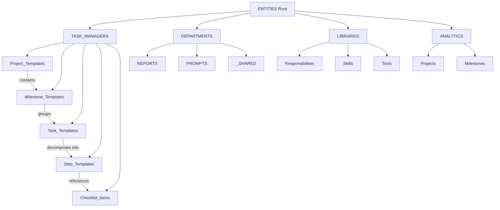
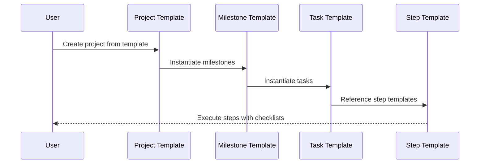
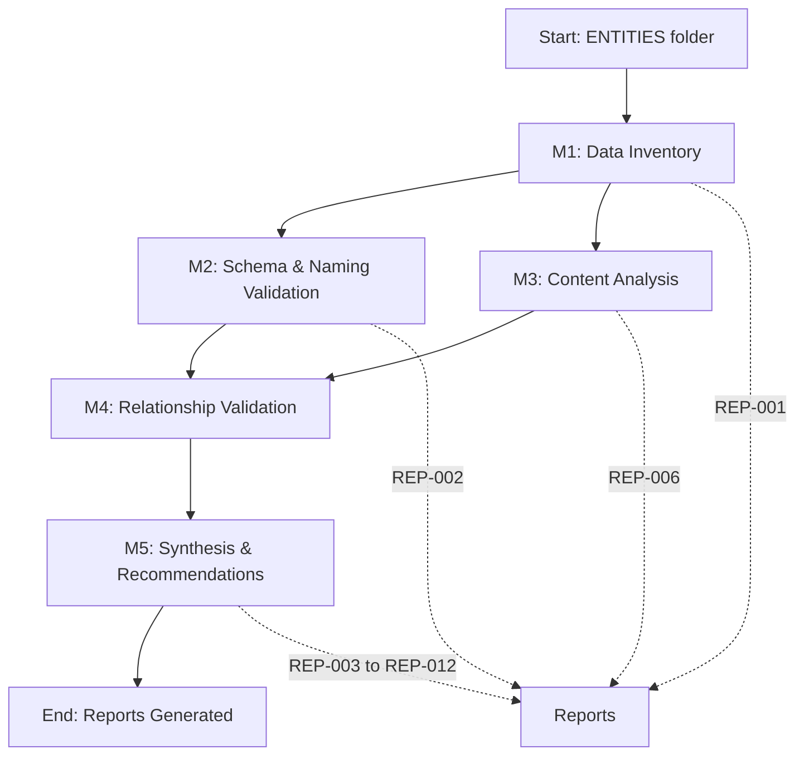

# ENTITIES Ecosystem Architecture Documentation

**Report ID:** REP-009
**Generated:** 2025-11-17
**Version:** 1.0
**Project:** PROJ-001 - ENTITIES Analysis

---

## Executive Overview

The ENTITIES ecosystem is a hierarchical template management system consisting of 1,245 files across 195 folders, totaling 43.09 MB. The architecture follows a four-level hierarchy: **Projects → Milestones → Tasks → Steps**, with additional support from Checklist Items.

---

## System Architecture Diagram



---

## Template Hierarchy

### Level 1: Project Templates
- **Location:** `TASK_MANAGERS/Project_Templates/`
- **ID Pattern:** `PROJ-TEMPL-{###}`
- **Purpose:** Top-level containers for multi-milestone initiatives
- **Count:** 2 templates
- **Key Fields:**
  - `project_template_id` (required)
  - `template_name` (required)
  - `milestone_templates` (array of milestone IDs)
  - `department`, `category`, `estimated_duration` (recommended)

**Example:**
```json
{
  "project_template_id": "PROJ-TEMPL-001",
  "template_name": "System Ecosystem Analysis",
  "milestone_templates": ["MIL-TEMPL-001", "MIL-TEMPL-002", ...]
}
```

### Level 2: Milestone Templates
- **Location:** `TASK_MANAGERS/Milestone_Templates/`
- **ID Pattern:** `MIL-TEMPL-{###}`
- **Purpose:** Phase-based groupings of related tasks
- **Count:** 11 templates
- **Key Fields:**
  - `milestone_template_id` (required)
  - `name` (required)
  - `task_templates` (array of task IDs)
  - `phase`, `can_run_parallel`, `dependencies` (recommended)

**Example:**
```json
{
  "milestone_template_id": "MIL-TEMPL-001",
  "name": "Data Inventory",
  "task_templates": ["TASK-TEMPLATE-ANALYSIS-001", ...]
}
```

### Level 3: Task Templates
- **Location:** `TASK_MANAGERS/Task_Templates/`
- **ID Pattern:** `TASK-TEMPLATE-{###}` or `TASK-TEMPLATE-{CATEGORY}-{###}`
- **Purpose:** Actionable work units with defined outputs
- **Count:** 53 templates
- **Key Fields:**
  - `task_template_id` (required)
  - `task_template_name` (required)
  - `category`, `department` (required)
  - `estimated_hours`, `step_templates`, `dependencies` (recommended)

**Example:**
```json
{
  "task_template_id": "TASK-TEMPLATE-ANALYSIS-001",
  "task_template_name": "File Count & Distribution",
  "department": "Analytics",
  "step_templates": ["STEP-ANALYSIS-001-01", "STEP-ANALYSIS-001-02"]
}
```

### Level 4: Step Templates
- **Location:** `TASK_MANAGERS/Step_Templates/`
- **ID Pattern (Documented):** `STEP-{###}`
- **ID Pattern (Actual):** `STEP-{CATEGORY}-{TASK#}-{STEP#}`
- **Purpose:** Granular instructions for task execution
- **Count:** 5 templates (56+ referenced but not yet created)
- **Key Fields:**
  - `step_template_id` (required)
  - `step_template_name` (required)
  - `checklist_items` (optional references to CHK-### items)

**Example:**
```json
{
  "step_template_id": "STEP-ANALYSIS-001-01",
  "step_template_name": "Initialize file counter",
  "checklist_items": ["CHK-001", "CHK-002"]
}
```

### Support Layer: Checklist Items
- **Location:** `TASK_MANAGERS/Checklist_Items/`
- **ID Pattern:** `CHK-{###}`
- **Purpose:** Reusable validation items referenced by steps
- **Count:** Unknown (not yet analyzed)
- **Key Fields:**
  - `checklist_item_id` (required)
  - `item_name` (required)
  - `status` (required)

---

## Entity Relationships

### Cross-Reference Map


**Analysis Results (from Milestone 4):**
- **72 cross-references** found across the ecosystem
  - 56 Task → Step references
  - 16 Milestone → Task references
  - 0 Project → Milestone references (templates defined inline)
- **56 broken references** (step templates not yet created)

---

## Department Structure

### DEPARTMENTS Folder
Contains outputs and documentation organized by department function.

```
DEPARTMENTS/
├── REPORTS/
│   └── System_Analysis/          # Analysis outputs
│       ├── Milestone_01_Data_Inventory/
│       ├── Milestone_02_Schema_Naming/
│       ├── Milestone_03_Content_Analysis/
│       └── Milestone_04_Relationship_Validation/
├── PROMPTS/
│   ├── Daily_Reports/
│   └── Weekly_Reports/
└── _SHARED/
    ├── Archive/
    ├── LIBRARIES/
    ├── Prompts/
    └── RESEARCHES/
```

---

## LIBRARIES Folder

### Responsibilities Library
- **Location:** `LIBRARIES/Responsibilities/`
- **Purpose:** Master list of organizational responsibilities
- **Structure:**
  - `Core/` - Core responsibility definitions
  - Action/object variant mappings
  - Phrase matching indexes

### Skills Library
- **Location:** `LIBRARIES/Skills/`
- **Purpose:** Skill definitions and categorization

### Tools Library
- **Location:** `LIBRARIES/Tools/`
- **Purpose:** Tool documentation and usage guides

---

## ANALYTICS Folder

### Projects Tracking
- **Location:** `ANALYTICS/Projects/`
- **Purpose:** Project instance tracking
- **Example:** `PROJ-001_ENTITIES_Analysis/`
  - README.md (progress dashboard)
  - Session_Summary.md (session notes)

### Milestones Tracking
- **Location:** `ANALYTICS/Milestones/`
- **Purpose:** Individual milestone instance files
- **Format:** JSON files with status, deliverables, findings

---

## File Distribution Analysis

| File Type | Count | Percentage | Use Case |
|-----------|-------|------------|----------|
| Markdown (.md) | 677 | 54.4% | Documentation, schemas, reports |
| JSON (.json) | 521 | 41.8% | Template definitions, data files |
| Python (.py) | 19 | 1.5% | Analysis scripts, automation |
| CSV (.csv) | 8 | 0.6% | Data exports, listings |
| Text (.txt) | 20 | 1.6% | Logs, notes |

**Total:** 1,245 files

---

## Naming Conventions

### JSON Field Naming
- **Standard:** `snake_case`
- **Pattern:** `^[a-z][a-z0-9_]*$`
- **Examples:**
  - `task_template_id` ✓
  - `step_template_name` ✓
  - `milestone_template_id` ✓

**Avoid:**
- camelCase (taskTemplateId)
- PascalCase (TaskTemplateID)
- Hyphens (task-template-id)
- Abbreviations (task_tmpl_id)

### Entity ID Naming
- **Standard:** `UPPERCASE-WITH-HYPHENS`
- **Zero-padded numbers:** Use `001` not `1`
- **Patterns:**
  - Steps: `STEP-{###}` (documented) or `STEP-{CATEGORY}-{TASK#}-{STEP#}` (actual)
  - Tasks: `TASK-TEMPLATE-{###}` or `TASK-TEMPLATE-{CATEGORY}-{###}`
  - Milestones: `MIL-TEMPL-{###}`
  - Projects: `PROJ-TEMPL-{###}`
  - Checklists: `CHK-{###}`

### File Naming
- **Templates:** `{TYPE}-{ID}_{Descriptive_Name}.json`
- **Schemas:** `{Entity}_Schema.md`
- **Listings:** `{Entity}_Listing.json`

**Examples:**
- `TASK-TEMPLATE-ANALYSIS-001_File_Count_Distribution.json` ✓
- `Task_Template_Schema.md` ✓

---

## Data Flow

### Template Creation Workflow



### Analysis Workflow (Current Project)



---

## Schema Compliance

### Required Fields by Entity Type

**Project Templates:**
- `project_template_id`
- `template_name`
- `milestone_templates`

**Milestone Templates:**
- `milestone_template_id`
- `name`
- `task_templates`

**Task Templates:**
- `task_template_id`
- `task_template_name`
- `category`
- `department`

**Step Templates:**
- `step_template_id`
- `step_template_name`

**Checklist Items:**
- `checklist_item_id`
- `item_name`
- `status`

### Recommended Fields (All Templates)
- `description`
- `version`
- `created`
- `last_updated`

### Current Compliance
- **Naming Convention:** 100% compliant (0 violations)
- **Schema Validation:** 138 violations
  - 97 critical (missing required fields)
  - 41 medium (missing recommended fields)

---

## Versioning Standards

### Format
- **Pattern:** `"version": "X.Y"` or `"version": "X.Y.Z"`
- **Semantic Versioning:**
  - X = Major version (breaking changes)
  - Y = Minor version (new features)
  - Z = Patch version (bug fixes)

### Current State
- **Files with versioning:** 167
- **Version format compliance:** 100%

---

## Index Files

### Located Indexes
- **Count:** 10 index files
- **Types:**
  - `INDEX.md` files (folder-level listings)
  - `*Listing.md` files (entity listings)

**Purpose:** Provide navigational aids and entity catalogs

---

## Storage Locations

### Primary Paths
```
C:\Users\Dell\Dropbox\ENTITIES\
├── TASK_MANAGERS\          # Template definitions
├── DEPARTMENTS\            # Departmental outputs
├── LIBRARIES\              # Reference libraries
├── ANALYTICS\              # Project/milestone tracking
├── SETTINGS\               # System configuration
├── BUSINESSES\             # Business contexts
├── JOBS\                   # Job definitions
├── TALENTS\                # Talent profiles
└── Accounts\               # Account management
```

### Analysis Output Paths
- **Reports:** `ANALYTICS/REPORTS/System_Analysis/`
- **Project Tracking:** `ANALYTICS/Projects/PROJ-001_ENTITIES_Analysis/`
- **Milestone Tracking:** `ANALYTICS/Milestones/`

---

## Key Metrics

| Metric | Value |
|--------|-------|
| Total Files | 1,245 |
| Total Folders | 195 |
| Total Size | 43.09 MB |
| Unique JSON Fields | 5,228 |
| Unique Markdown Headings | 14,580 |
| Unique Terms | 14,955 |
| Template IDs | 71 (5 steps, 53 tasks, 11 milestones, 2 projects) |
| Cross-References | 72 |
| Broken References | 56 |

---

## Technology Stack

### File Formats
- **JSON:** Template definitions, data exports
- **Markdown:** Documentation, schemas, reports
- **Python:** Analysis scripts, automation
- **CSV:** Tabular data exports

### Analysis Tools
- **Python libraries:** pathlib, json, collections, ast, re
- **Markdown rendering:** CommonMark-compliant
- **Diagram generation:** Mermaid (for architecture diagrams)

---

## Design Principles

1. **Hierarchical Organization:** Clear parent-child relationships
2. **Template-Instance Pattern:** Templates define structure, instances track execution
3. **Naming Consistency:** snake_case for fields, UPPERCASE-HYPHENS for IDs
4. **Full Descriptors:** Avoid abbreviations for clarity
5. **Cross-Reference Validation:** Maintain referential integrity
6. **Version Control:** Track template evolution
7. **Documentation First:** Every template has schema documentation

---

## Future Architecture Considerations

### Scalability
- Current structure supports unlimited template growth
- Folder organization supports departmental isolation
- Analytics tracking separated from operational templates

### Extensibility
- New entity types can be added to TASK_MANAGERS
- LIBRARIES can grow to include new reference materials
- Department-specific folders can be added under DEPARTMENTS

### Maintenance
- Centralized schemas enable bulk validation
- Naming standards prevent drift
- Index files provide navigational aids

---

## References

- Template schemas: `TASK_MANAGERS/{Entity}_Templates/{Entity}_Template_Schema.md`
- Naming standards: [REP-002_Naming_Convention_Audit.md](REP-002_Naming_Convention_Audit.md)
- Terminology standards: [REP-006_terminology_standards.json](REP-006_terminology_standards.json)
- Project tracking: `ANALYTICS/Projects/PROJ-001_ENTITIES_Analysis/README.md`

---

*This architecture documentation is a living document and should be updated as the system evolves.*
