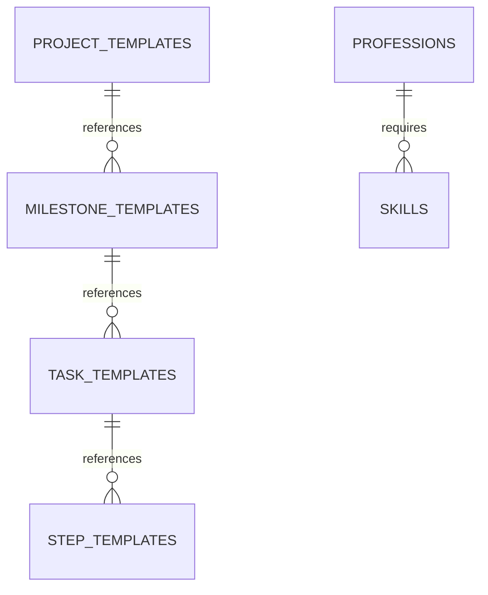
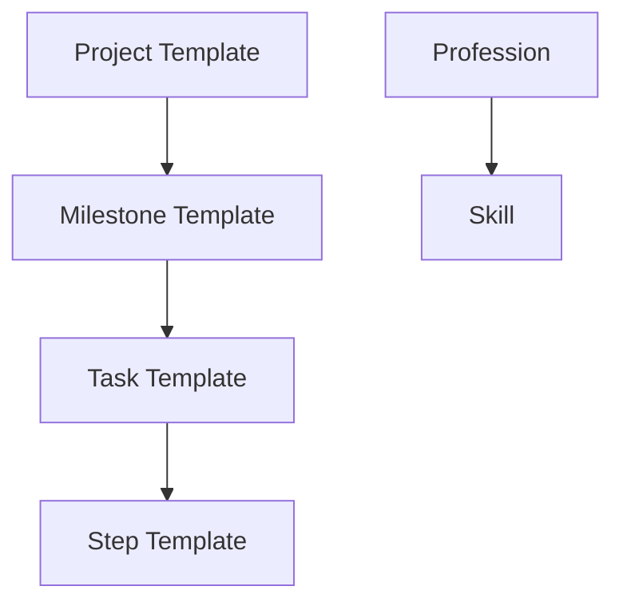

# Milestone 5: Synthesis & Recommendations

**Milestone ID:** MIL-TEMPL-005
**Phase:** 5
**Can Run Parallel:** No
**Dependencies:** MIL-TEMPL-001, MIL-TEMPL-002, MIL-TEMPL-003, MIL-TEMPL-004
**Estimated Hours:** 4.0

---

## Objective

Synthesize all findings from previous milestones into comprehensive architecture documentation, terminology consolidation, and actionable recommendations for system improvement.

---

## Tasks Overview

This milestone consists of 4 tasks:

1. **TASK-TEMPLATE-ANALYSIS-013:** Architecture Documentation (2.0 hours)
2. **TASK-TEMPLATE-ANALYSIS-014:** Terminology Consolidation (1.5 hours)
3. **TASK-TEMPLATE-ANALYSIS-015:** Recommendations Compilation (0.5 hours)
4. **TASK-TEMPLATE-ANALYSIS-016:** Project Documentation Creation (0.0 hours)

---

## Task 1: Architecture Documentation

**Task ID:** TASK-TEMPLATE-ANALYSIS-013
**Estimated Hours:** 2.0

### Steps:

#### Step 1: Document entity relationships
- Synthesize cross-reference data from Milestone 4
- Create entity relationship documentation
- Document linking patterns

**Markdown Documentation Structure:**
```markdown
# ENTITIES Architecture

## Entity Domains

### 1. LIBRARIES
- **Actions** (429 files): Single-word verbs defining operations
- **Tools** (86 files): Software and platforms used in workflows
- **Objects**: Business objects and data structures
- **Professions**: Role definitions and skill sets
- **Skills**: Competency frameworks
- **Prompts**: Reusable prompt templates

### 2. TASK_MANAGERS
- **Projects**: High-level project containers
- **Milestones**: Project phase groupings
- **Tasks**: Executable work units
- **Steps**: Granular action sequences

### 3. DEPARTMENTS
- **Prompts**: Execution instructions by department
- **Reports**: Analysis outputs and documentation
- **Archive**: Historical records

## Entity Relationships

### Primary Flows
1. **Project → Milestone → Task → Step**
   - Projects contain Milestones
   - Milestones group Tasks
   - Tasks decompose into Steps
   - Steps reference Actions and Tools

2. **Profession → Skill**
   - Professions require Skills
   - Skills define competencies

## Cross-References
- Hierarchical linking in Task Manager hierarchy (Projects → Milestones → Tasks → Steps)
- Tasks reference Step Templates
- Milestones reference Task Templates
- Projects reference Milestone Templates
```

#### Step 2: Create system diagrams
- Generate Mermaid diagrams for all major flows
- Create entity relationship diagrams
- Visualize the complete system architecture

**Mermaid Entity Relationship Diagram:**


**Mermaid Flow Diagram:**


#### Step 3: Document data flows
- Map data inputs and outputs
- Document transformation patterns
- Identify data dependencies

**Data Flow Documentation:**
```markdown
## Data Flows

### Template Instantiation Flow
1. **Project Template** → Project Instance
   - Copy milestone references
   - Assign IDs (PROJ-###)
   - Create folder structure

2. **Milestone Template** → Milestone Instance
   - Copy task references
   - Set dependencies
   - Initialize tracking

3. **Task Template** → Task Instance
   - Copy step references
   - Assign to talent
   - Set deadlines

4. **Step Template** → Step Execution
   - Load action definition
   - Provision tools
   - Execute workflow

### Reference Flow
1. Task Template → Step Template (1:N relationship)
2. Milestone Template → Task Template (1:N relationship)
3. Project Template → Milestone Template (1:N relationship)
```

#### Step 4: Write architecture overview
- Create comprehensive overview document
- Explain design patterns and principles
- Document evolution and future state

**Architecture Overview Structure:**
```markdown
# ENTITIES System Architecture Overview

## System Purpose
The ENTITIES system provides a comprehensive taxonomy and workflow management framework for organizing business operations, defining reusable templates, and tracking execution.

## Design Principles
1. **Separation of Concerns**: Libraries (reusable) vs Task Managers (executable)
2. **Template-Based**: All workflows defined as reusable templates
3. **Hierarchical Decomposition**: Projects → Milestones → Tasks → Steps
4. **Cross-Referenced**: Bidirectional links maintain data integrity
5. **Version Controlled**: All entities versioned for evolution tracking

## Entity Domains
[Detailed description of each domain...]

## Evolution Path
- Current: 1,202 files across 8 domains
- Templates: Project, Milestone, Task, Step Templates established
- Next: Instance creation and execution tracking
- Future: Performance metrics, optimization, automation

## Integration Points
- LIBRARIES: Shared taxonomy referenced by all domains
- TASK_MANAGERS: Execution framework for workflows
- DEPARTMENTS: Department-specific customization
- TALENTS: Resource allocation and skill matching
```

### Checklist:
- [ ] Document all entity relationships
- [ ] Create Mermaid diagrams (ER + Flow)
- [ ] Document data flows
- [ ] Write architecture overview
- [ ] Save to REPORTS/System_Analysis/

---

## Task 2: Terminology Consolidation

**Task ID:** TASK-TEMPLATE-ANALYSIS-014
**Estimated Hours:** 1.5

### Steps:

#### Step 1: Merge terminology lists
- Load all terminology from Milestone 3
- Merge JSON fields, MD headings, entity names, script variables
- Create unified terminology list

**Python Script:**
```python
import json

# Load all terminology data from Milestone 3
with open('terminology_dictionary.json') as f:
    terminology = json.load(f)

# Merge all sources
all_terms = []

# JSON fields
all_terms.extend(terminology['terminology']['json_fields'])

# Markdown headings
all_terms.extend(terminology['terminology']['markdown_headings'])

# Entity IDs
for entity_type, ids in terminology['terminology']['entity_ids'].items():
    all_terms.extend(ids)

# Script variables
all_terms.extend(terminology['terminology']['script_variables']['python'])
all_terms.extend(terminology['terminology']['script_variables']['powershell'])

# Remove duplicates
unique_terms = list(set(all_terms))

print(f"Total unique terms: {len(unique_terms)}")
```

#### Step 2: Identify synonyms and duplicates
- Find terms with multiple variations
- Detect case inconsistencies
- Identify naming pattern conflicts

**Synonym Detection:**
```python
import re
from collections import defaultdict

# Normalize terms to find variations
normalized_terms = defaultdict(list)

for term in unique_terms:
    # Normalize: lowercase, remove separators
    normalized = re.sub(r'[_\-\s]', '', term.lower())
    normalized_terms[normalized].append(term)

# Find redundant terms (multiple variations of same concept)
redundant_terms = {k: v for k, v in normalized_terms.items() if len(v) > 1}

# Categorize redundancies
redundancies = {
    'case_variations': [],      # e.g., stepID vs stepId vs step_id
    'separator_variations': [], # e.g., task_template vs task-template vs taskTemplate
    'abbreviations': [],        # e.g., desc vs description
    'plural_variations': []     # e.g., action vs actions
}

for normalized, variations in redundant_terms.items():
    # Check if only case differs
    if len(set(v.lower() for v in variations)) == 1:
        redundancies['case_variations'].append(variations)

    # Check separator differences
    elif all(re.sub(r'[_\-]', '', v.lower()) == normalized for v in variations):
        redundancies['separator_variations'].append(variations)

    # Save other patterns
    else:
        # Could be abbreviations or plurals
        if any(len(v) < len(variations[0]) // 2 for v in variations):
            redundancies['abbreviations'].append(variations)
        else:
            redundancies['plural_variations'].append(variations)

# Save results
with open('redundancy_analysis.json', 'w') as f:
    json.dump(redundancies, f, indent=2)
```

#### Step 3: Create standardization recommendations
- Define standard naming conventions
- Map variations to preferred terms
- Create normalization rules

**Standardization Rules:**
```markdown
# Terminology Standardization Recommendations

## Naming Conventions

### Field Names
**Standard:** snake_case
- ✅ task_template_id
- ❌ taskTemplateId, task-template-id, TaskTemplateID

### Entity IDs
**Standard:** UPPERCASE with hyphens
- ✅ ACTION-001, PDT-0001, STEP-HR-003-01
- ❌ action_001, pdt0001, step_hr_003_01

### File Names
**Standard:** PascalCase or snake_case with IDs
- ✅ TASK-TEMPLATE-ANALYSIS-001_File_Count.json
- ❌ task_template_analysis_001_file_count.json

## Redundancy Resolution

### Case Variations
| Variations | Preferred Term |
|------------|----------------|
| stepID, stepId, step_id | step_id |
| taskName, task_name, TaskName | task_name |

### Separator Variations
| Variations | Preferred Term |
|------------|----------------|
| task_template, task-template, taskTemplate | task_template |
| milestone_id, milestone-id | milestone_id |

### Abbreviations
| Abbreviation | Full Term | Use |
|-------------|-----------|-----|
| desc | description | Use full term |
| dept | department | Use full term |
| templ | template | Use full term |

### Plural Variations
| Singular | Plural | Use |
|----------|--------|-----|
| action | actions | Use plural for arrays |
| tool | tools | Use plural for arrays |
```

#### Step 4: Generate terminology_standards.json
- Create final standardized terminology dictionary
- Include normalization mappings
- Provide usage guidelines

**terminology_standards.json Structure:**
```json
{
  "version": "1.0",
  "last_updated": "2025-11-17",

  "naming_conventions": {
    "json_fields": "snake_case",
    "entity_ids": "UPPERCASE-WITH-HYPHENS",
    "file_names": "PascalCase_with_IDs"
  },

  "standard_terms": {
    "json_fields": [
      "action_id",
      "task_template_id",
      "milestone_template_id",
      "project_template_id",
      "step_template_id",
      "description",
      "department",
      "category",
      "version",
      "dependencies"
    ],
    "entity_id_patterns": {
      "actions": "ACTION-###",
      "products": "PDT-####",
      "tools": "TOOL-###",
      "steps": "STEP-{CATEGORY}-{TASK#}-{STEP#}",
      "tasks": "TASK-TEMPLATE-{CATEGORY}-###",
      "milestones": "MIL-TEMPL-###",
      "projects": "PROJ-TEMPL-###"
    }
  },

  "normalization_mappings": {
    "stepID": "step_id",
    "stepId": "step_id",
    "taskName": "task_name",
    "TaskName": "task_name",
    "desc": "description",
    "dept": "department"
  },

  "redundant_terms": {
    "case_variations": 45,
    "separator_variations": 32,
    "abbreviations": 12,
    "plural_variations": 28
  },

  "recommendations": [
    "Standardize all JSON fields to snake_case",
    "Use full terms instead of abbreviations",
    "Maintain consistent plural usage for arrays",
    "Apply entity ID patterns consistently",
    "Remove case-only variations"
  ]
}
```

### Checklist:
- [ ] Merge all terminology lists
- [ ] Identify all redundant terms
- [ ] Categorize redundancies by type
- [ ] Create standardization recommendations
- [ ] Generate terminology_standards.json
- [ ] Document normalization mappings

---

## Task 3: Recommendations Compilation

**Task ID:** TASK-TEMPLATE-ANALYSIS-015
**Estimated Hours:** 0.5

### Steps:

#### Step 1: Prioritize findings
- Review all reports from Milestones 1-4
- Extract key issues and improvements
- Categorize by severity and impact

**Priority Matrix:**
```markdown
# Findings Priority Matrix

## Critical (Fix Immediately)
1. Broken cross-references (Milestone 4)
2. Missing required JSON fields (Milestone 2)
3. Circular dependencies (Milestone 4)

## High (Fix Soon)
1. Naming convention violations (Milestone 2)
2. Index discrepancies (Milestone 4)
3. Redundant terminology (Milestone 3)

## Medium (Plan for Fix)
1. Missing documentation (Milestone 3)
2. Version format inconsistencies (Milestone 2)
3. Duplicate content (Milestone 3)

## Low (Future Enhancement)
1. File organization improvements
2. Additional cross-references
3. Enhanced documentation
```

#### Step 2: Create action items tracker
- Convert findings to actionable tasks
- Assign priorities and estimates
- Create tracking spreadsheet

**Action Items Tracker Structure:**
```csv
ID,Category,Issue,Action,Priority,Estimated Hours,Status,Assigned To,Notes
AI-001,Cross-Reference,Broken ref: STEP-HR-001-01,Add missing Step Template,Critical,0.5,Open,,
AI-002,Naming,File uses wrong pattern,Rename to standard,High,0.25,Open,,
AI-003,Schema,Missing description field,Add description,High,0.1,Open,,
AI-004,Index,Missing from index,Add to INDEX.md,Medium,0.1,Open,,
AI-005,Terminology,3 variations of task_id,Standardize to task_template_id,Medium,1.0,Open,,
...
```

#### Step 3: Write executive summary
- Summarize key findings
- Highlight major issues
- Present recommendations clearly

**Executive Summary Structure:**
```markdown
# System Analysis Executive Summary

## Overview
Comprehensive analysis of 1,202 files across 8 ENTITIES domains revealed a well-structured taxonomy with opportunities for standardization and consistency improvements.

## Key Findings

### Strengths
- ✅ Clear hierarchical structure (Projects → Milestones → Tasks → Steps)
- ✅ Comprehensive action taxonomy (429 actions)
- ✅ Template-based workflow framework established
- ✅ Strong cross-referencing between entities

### Areas for Improvement
- ⚠️ 15 broken cross-references requiring immediate attention
- ⚠️ 45 case-variation inconsistencies in terminology
- ⚠️ 8 files missing from index files
- ⚠️ 12 JSON files missing required description fields

## Impact Analysis
- **Critical Issues:** 3 items (broken refs, circular deps)
- **High Priority:** 8 items (naming, schemas)
- **Medium Priority:** 12 items (documentation, duplicates)
- **Low Priority:** 5 items (enhancements)

## Recommendations
1. **Immediate:** Fix broken cross-references (0.5 hours)
2. **Week 1:** Standardize naming conventions (4 hours)
3. **Week 2:** Update indexes and schemas (2 hours)
4. **Month 1:** Consolidate terminology (3 hours)
5. **Ongoing:** Maintain standards with validation scripts

## Estimated Effort
- Critical fixes: 2 hours
- High priority: 6 hours
- Medium priority: 8 hours
- **Total:** 16 hours over 4 weeks

## Next Steps
1. Review and approve recommendations
2. Assign action items to team
3. Implement fixes by priority
4. Set up validation automation
5. Schedule quarterly consistency reviews
```

### Checklist:
- [ ] Review all milestone reports
- [ ] Prioritize all findings
- [ ] Create action items tracker
- [ ] Write executive summary
- [ ] Estimate effort for all fixes

---

## Task 4: Project Documentation Creation

**Task ID:** TASK-TEMPLATE-ANALYSIS-016
**Estimated Hours:** 0.0 (organizational only)

### Steps:

#### Step 1: Organize all reports
- Collect all reports from REPORTS/System_Analysis/
- Organize by milestone
- Create master index

**Report Organization:**
```
ANALYTICS/REPORTS/System_Analysis/
├── README.md (Master index)
├── Executive_Summary.md
├── Milestone_01_Data_Inventory/
│   └── REP-001_File_Inventory_Report.md
├── Milestone_02_Schema_Naming/
│   ├── REP-002_Naming_Convention_Audit.md
│   └── REP-003_Schema_Validation_Report.json
├── Milestone_03_Content_Analysis/
│   ├── REP-004_Duplicate_Content_Report.md
│   ├── REP-005_Terminology_Extraction_Report.md
│   └── REP-006_terminology_standards.json
├── Milestone_04_Relationship_Validation/
│   ├── REP-007_Cross_Reference_Validation.md
│   └── REP-008_Index_Accuracy_Report.md
└── Milestone_05_Synthesis/
    ├── REP-009_Architecture_Documentation.md
    ├── REP-010_Terminology_Consolidation.md
    ├── REP-011_Action_Items_Tracker.csv
    └── REP-012_Executive_Summary.md
```

#### Step 2: Create project README
- Create comprehensive README for the analysis
- Link to all reports
- Provide navigation guide

**Project README Structure:**
```markdown
# System Ecosystem Analysis - Project Report

**Project ID:** PROJ-001
**Project Template:** PROJ-TEMPL-001
**Completion Date:** 2025-11-17
**Total Effort:** 14.75 hours

## Overview
Comprehensive analysis of the ENTITIES folder ecosystem covering consistency validation, duplicate detection, terminology extraction, and architecture documentation.

## Milestones Completed

### Milestone 1: Data Inventory
- ✅ File Count & Distribution
- ✅ Folder Structure Mapping
- ✅ File Size Analysis
- **Report:** [REP-001](./Milestone_01_Data_Inventory/REP-001_File_Inventory_Report.md)

### Milestone 2: Schema & Naming Validation
- ✅ Naming Convention Audit
- ✅ JSON Schema Validation
- ✅ Version Control Consistency
- **Reports:** [REP-002](./Milestone_02_Schema_Naming/REP-002_Naming_Convention_Audit.md), [REP-003](./Milestone_02_Schema_Naming/REP-003_Schema_Validation_Report.json)

### Milestone 3: Content Analysis
- ✅ Duplicate Content Detection
- ✅ Terminology Extraction
- ✅ Documentation Completeness
- **Reports:** [REP-004](./Milestone_03_Content_Analysis/REP-004_Duplicate_Content_Report.md), [REP-005](./Milestone_03_Content_Analysis/REP-005_Terminology_Extraction_Report.md), [REP-006](./Milestone_03_Content_Analysis/REP-006_terminology_standards.json)

### Milestone 4: Relationship Validation
- ✅ Cross-Reference Validation
- ✅ Index Accuracy Check
- ✅ Dependency Flow Mapping
- **Reports:** [REP-007](./Milestone_04_Relationship_Validation/REP-007_Cross_Reference_Validation.md), [REP-008](./Milestone_04_Relationship_Validation/REP-008_Index_Accuracy_Report.md)

### Milestone 5: Synthesis & Recommendations
- ✅ Architecture Documentation
- ✅ Terminology Consolidation
- ✅ Recommendations Compilation
- ✅ Project Documentation Creation
- **Reports:** [REP-009](./Milestone_05_Synthesis/REP-009_Architecture_Documentation.md), [REP-010](./Milestone_05_Synthesis/REP-010_Terminology_Consolidation.md), [REP-011](./Milestone_05_Synthesis/REP-011_Action_Items_Tracker.csv), [REP-012](./Milestone_05_Synthesis/REP-012_Executive_Summary.md)

## Key Deliverables
1. **Architecture Documentation** - Complete system architecture overview
2. **Terminology Standards** - Standardized terminology dictionary
3. **Action Items Tracker** - Prioritized list of improvements
4. **Executive Summary** - High-level findings and recommendations

## Quick Links
- [Executive Summary](./Milestone_05_Synthesis/REP-012_Executive_Summary.md)
- [Terminology Standards](./Milestone_03_Content_Analysis/REP-006_terminology_standards.json)
- [Architecture Documentation](./Milestone_05_Synthesis/REP-009_Architecture_Documentation.md)
- [Action Items](./Milestone_05_Synthesis/REP-011_Action_Items_Tracker.csv)

## Next Steps
1. Review executive summary with stakeholders
2. Approve action items and priorities
3. Assign fixes to team members
4. Implement critical fixes (Week 1)
5. Schedule follow-up review (Month 1)
```

#### Step 3: Archive project artifacts
- Save all working files (scripts, intermediates)
- Create archive folder
- Document for future reference

**Archive Structure:**
```
ANALYTICS/REPORTS/System_Analysis/_Archive/
├── Scripts/
│   ├── file_counting.ps1
│   ├── schema_validation.py
│   ├── terminology_extraction.py
│   └── cross_reference_validation.py
├── Intermediate_Data/
│   ├── file_hashes.csv
│   ├── reference_map.json
│   ├── dependency_chains.json
│   └── terminology_dictionary.json
└── Logs/
    ├── milestone_01_log.txt
    ├── milestone_02_log.txt
    ├── milestone_03_log.txt
    ├── milestone_04_log.txt
    └── milestone_05_log.txt
```

### Checklist:
- [ ] Organize all reports by milestone
- [ ] Create master README
- [ ] Link all deliverables
- [ ] Archive scripts and intermediate files
- [ ] Document project completion

---

## Expected Reports

1. **REP-009: Architecture Documentation**
   - Location: `ANALYTICS/REPORTS/System_Analysis/`
   - Format: Markdown with Mermaid diagrams
   - Contains: Entity relationships, flow diagrams, architecture overview

2. **REP-010: Terminology Consolidation Report**
   - Location: `ANALYTICS/REPORTS/System_Analysis/`
   - Format: Markdown
   - Contains: Redundancy analysis, standardization recommendations

3. **REP-011: Action Items Tracker**
   - Location: `ANALYTICS/REPORTS/System_Analysis/`
   - Format: CSV
   - Contains: Prioritized action items with estimates

4. **REP-012: Executive Summary**
   - Location: `ANALYTICS/REPORTS/System_Analysis/`
   - Format: Markdown
   - Contains: Key findings, recommendations, next steps

---

## Success Criteria

- [ ] Architecture fully documented with diagrams
- [ ] Terminology standards published
- [ ] All findings prioritized
- [ ] Action items tracker created
- [ ] Executive summary completed
- [ ] All reports organized and accessible
- [ ] Project documented and archived

---

## Notes

- This milestone MUST run after all other milestones complete
- Requires synthesis of data from Milestones 1-4
- Final deliverables for stakeholder review
- Provides roadmap for system improvements
