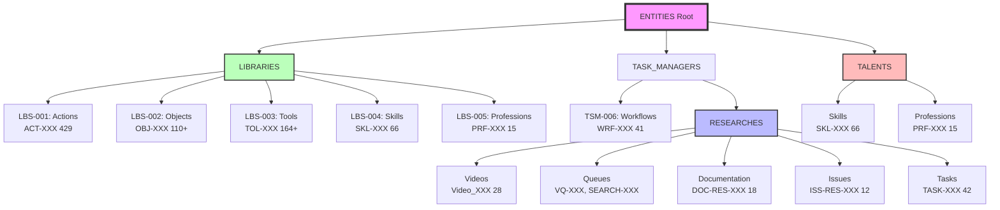

# ID Ecosystem - Visual Map

**Document ID:** DOC-RES-018
**Version:** 1.0
**Date:** 2025-12-10
**Status:** ✅ Complete
**Purpose:** Visual representation of the unified ID ecosystem

---

## Overview

This document provides **visual diagrams** of the ID ecosystem, showing relationships, hierarchies, and integration patterns across the RESEARCHES module and ENTITIES taxonomy.

---

## 1. Complete Ecosystem Hierarchy

### ASCII Diagram

```
┌─────────────────────────────────────────────────────────────────┐
│                      ENTITIES (Global Root)                     │
│                         ~1,450+ Entities                        │
└───────────────────────────────┬─────────────────────────────────┘
                                │
                ┌───────────────┴────────────────┬────────────────┐
                │                                │                │
        ┌───────▼────────┐            ┌─────────▼─────────┐  ┌───▼────────┐
        │   LIBRARIES    │            │  TASK_MANAGERS    │  │  TALENTS   │
        │   (8 modules)  │            │   (7 modules)     │  │(2 modules) │
        └───────┬────────┘            └─────────┬─────────┘  └───┬────────┘
                │                                │                │
    ┌───────────┴────────┐           ┌──────────┴─────┐         │
    │                    │           │                │         │
┌───▼────┐    ┌─────────▼────┐  ┌───▼─────┐   ┌─────▼────────┐ │
│ LBS-001│    │   LBS-002    │  │TSM-006  │   │  RESEARCHES  │ │
│Actions │    │  Objects     │  │Workflows│   │ (This Module)│ │
│        │    │              │  │         │   │              │ │
│ACT-XXX │    │OBJ-{CAT}-XXX │  │WRF-XXX  │   │  Multiple    │ │
│429     │    │110+          │  │41       │   │  ID Systems  │ │
└────────┘    └──────────────┘  └─────────┘   └──────┬───────┘ │
                                                      │         │
                                        ┌─────────────┴────┐    │
                                        │                  │    │
              ┌─────────────────────────▼──┐    ┌──────────▼────▼────┐
              │     Documentation          │    │   Global Shared    │
              │   ┌──────────────────┐     │    │                    │
              │   │ DOC-RES-XXX (17) │     │    │  SKL-XXX (66)      │
              │   │ ISS-RES-XXX (12) │     │    │  PRF-XXX (15)      │
              │   │ PHS-RES-XXX (9)  │     │    │  TASK-XXX (42)     │
              │   │ TASK-XXX (42)    │     │    │                    │
              │   │ CHG-RES-XXX      │     │    └────────────────────┘
              │   │ RSH-TAX-XXX (1)  │     │
              │   └──────────────────┘     │
              │                            │
              │     Video Processing       │
              │   ┌──────────────────┐     │
              │   │ Video_XXX (28)   │     │
              │   │ VQ-XXX (42)      │     │
              │   │ SEARCH-XXX (15)  │     │
              │   │ RSR-XXX (24)     │     │
              │   └──────────────────┘     │
              └────────────────────────────┘
```

---

## 2. ID Namespace Categories

### By Scope

```
┌────────────────────────────────────────────────────────────────┐
│                     ID NAMESPACE CATEGORIES                    │
└────────────────────────────────────────────────────────────────┘

┌──────────────────────┐  ┌──────────────────┐  ┌─────────────────────┐
│  MODULE-SPECIFIC     │  │     GLOBAL       │  │   CATEGORIZED       │
│  [PREFIX]-RES-[NUM]  │  │  [PREFIX]-[NUM]  │  │ [PREFIX]-[CAT]-[NUM]│
├──────────────────────┤  ├──────────────────┤  ├─────────────────────┤
│                      │  │                  │  │                     │
│ ✓ ISS-RES-XXX (12)   │  │ ✓ TASK-XXX (42)  │  │ ✓ WRF-SEC-014       │
│ ✓ PHS-RES-XXX (9)    │  │ ✓ SKL-XXX (66)   │  │ ✓ TOL-AI-223        │
│ ✓ CHG-RES-XXX        │  │ ✓ PRF-XXX (15)   │  │ ✓ OBJ-SMM-015       │
│ ✓ DOC-RES-XXX (18)   │  │                  │  │ ✓ WRF-DGN-XXX       │
│ ✓ RSH-TAX-XXX (1)    │  │                  │  │ ✓ TOL-VID-XXX       │
│                      │  │                  │  │                     │
│ Scope: RESEARCHES    │  │ Scope: Any       │  │ Scope: Domain       │
│ only                 │  │ module           │  │ specific            │
└──────────────────────┘  └──────────────────┘  └─────────────────────┘
```

---

## 3. Integration Flow Patterns

### Pattern 1: Video → Entity Creation

```
                        ┌──────────────────────────┐
                        │   Video Processing      │
                        │                          │
                        │   Video_024 (Source)     │
                        │   "n8n Quickstart"       │
                        └────────────┬─────────────┘
                                     │
                     ┌───────────────▼─────────────┐
                     │  PMT-007 Prompt Applied    │
                     │  (Objects Library Extract)  │
                     └───────────────┬─────────────┘
                                     │
                         ┌───────────┴──────────┐
                         │                      │
                ┌────────▼────────┐   ┌─────────▼──────────┐
                │  RSR-024        │   │ Extraction Report  │
                │  (Wrapper)      │   │ Analysis Generated │
                └────────┬────────┘   └────────────────────┘
                         │
             ┌───────────┴─────────────┐
             │                         │
    ┌────────▼─────────┐    ┌─────────▼─────────┐
    │  TOL-AI-223      │    │  WRF-SEC-014      │
    │  Browse AI       │    │  Secure OAuth     │
    │  (Tool Created)  │    │  (Workflow        │
    │                  │    │   Created)        │
    └────────┬─────────┘    └─────────┬─────────┘
             │                        │
             └────────────┬───────────┘
                          │
              ┌───────────▼──────────────┐
              │ ENTITIES/LIBRARIES/      │
              │ (Final Integration)      │
              │                          │
              │ TOL-AI-223.json          │
              │ WRF-SEC-014.json         │
              │                          │
              │ Bidirectional Links:     │
              │ source_video: Video_024  │
              └──────────────────────────┘
```

### Pattern 2: Issue → Task → Change → Document

```
   ┌─────────────────────────────────────────────────┐
   │              PROBLEM IDENTIFIED                 │
   │                                                 │
   │  ISS-RES-011: Missing unified ID system         │
   │  Priority: HIGH                                 │
   │  Status: OPEN                                   │
   └──────────────────────┬──────────────────────────┘
                          │
                          │ resolved by
                          ▼
   ┌─────────────────────────────────────────────────┐
   │              TASK CREATED                       │
   │                                                 │
   │  TASK-XXX: Create ID system documentation      │
   │  Phase: PHS-RES-001 (Stabilization)            │
   │  Effort: 3-4 hours                             │
   └──────────────────────┬──────────────────────────┘
                          │
                          │ implemented in
                          ▼
   ┌─────────────────────────────────────────────────┐
   │            CHANGE IMPLEMENTED                   │
   │                                                 │
   │  CHG-RES-20251203-001                           │
   │  Type: DOCS                                     │
   │  Files: 16 new documentation files              │
   │  Impact: Resolved ISS-RES-011                   │
   └──────────────────────┬──────────────────────────┘
                          │
               ┌──────────┴──────────┐
               │                     │
               ▼                     ▼
   ┌──────────────────────┐   ┌────────────────────┐
   │  DOC-RES-004         │   │  DOC-RES-017       │
   │  04_ID_System_       │   │  ID_MASTER_        │
   │  Standard.md         │   │  REGISTRY.md       │
   │                      │   │                    │
   │  ✅ Complete ID      │   │  ✅ Registry of    │
   │  specification       │   │  all IDs           │
   └──────────────────────┘   └────────────────────┘
                          │
                          │ result
                          ▼
   ┌─────────────────────────────────────────────────┐
   │           ISSUE RESOLVED                        │
   │                                                 │
   │  ISS-RES-011: RESOLVED ✅                       │
   │  Verification: Documentation in place           │
   │  Closed: 2025-12-03                             │
   └─────────────────────────────────────────────────┘
```

### Pattern 3: Research Taxonomy Integration

```
       ┌──────────────────────────────────────┐
       │   RESEARCHES Module (Source)         │
       │                                      │
       │   28 Videos Processed                │
       │   Video_001 through Video_028        │
       └────────────────┬─────────────────────┘
                        │
                        │ extracts
                        ▼
       ┌──────────────────────────────────────┐
       │   Entities Discovered                │
       │                                      │
       │   • 93 Workflows (WRF)               │
       │   • 145 Tools (TOL)                  │
       │   • 178 Objects (OBJ)                │
       │   • 98 Actions (ACT)                 │
       │   • 67 Profiles (PRF)                │
       │   • 124 Skills (SKL)                 │
       │   • 47 Departments (DPT)             │
       │                                      │
       │   Total: 752+ entities               │
       └────────────────┬─────────────────────┘
                        │
                        │ integrates to
                        ▼
       ┌──────────────────────────────────────┐
       │   ENTITIES Taxonomy                  │
       │                                      │
       │   LIBRARIES/                         │
       │   ├── LBS-001: Actions               │
       │   ├── LBS-002: Objects               │
       │   ├── LBS-003: Tools                 │
       │   ├── LBS-004: Skills                │
       │   ├── LBS-005: Professions           │
       │   ├── LBS-006: Departments           │
       │   └── LBS-007: Responsibilities      │
       │                                      │
       │   TASK_MANAGERS/                     │
       │   └── TSM-006: Workflows             │
       │                                      │
       │   TALENTS/                           │
       │   ├── Skills                         │
       │   └── Professions                    │
       └──────────────────────────────────────┘
```

---

## 4. ID Relationship Matrix

### Cross-Reference Map

```
                    ┌─────────────────────────────────┐
                    │      ID RELATIONSHIPS           │
                    └─────────────────────────────────┘

┌────────────┬──────────────────────────────────────────────────┐
│ FROM       │ CAN REFERENCE                                    │
├────────────┼──────────────────────────────────────────────────┤
│ Video_XXX  │ → VQ-XXX, SEARCH-XXX, RSR-XXX                    │
│            │ → Created: WRF-XXX, TOL-XXX, OBJ-XXX, SKL-XXX    │
├────────────┼──────────────────────────────────────────────────┤
│ ISS-RES-XXX│ → TASK-XXX (resolving tasks)                     │
│            │ → CHG-RES-XXX (implementing changes)             │
│            │ → DOC-RES-XXX (documentation)                    │
│            │ → PHS-RES-XXX (target phase)                     │
├────────────┼──────────────────────────────────────────────────┤
│ TASK-XXX   │ → ISS-RES-XXX (resolves issues)                  │
│            │ → PHS-RES-XXX (belongs to phase)                 │
│            │ → CHG-RES-XXX (implemented as change)            │
├────────────┼──────────────────────────────────────────────────┤
│ CHG-RES-XXX│ → ISS-RES-XXX (addresses issues)                 │
│            │ → TASK-XXX (implements tasks)                    │
│            │ → DOC-RES-XXX (affects documents)                │
│            │ → Video_XXX, WRF-XXX, TOL-XXX, etc.              │
├────────────┼──────────────────────────────────────────────────┤
│ DOC-RES-XXX│ → ISS-RES-XXX (documents issues)                 │
│            │ → CHG-RES-XXX (created by change)                │
│            │ → All other ID types (references)                │
├────────────┼──────────────────────────────────────────────────┤
│ WRF-XXX    │ → Video_XXX (source)                             │
│            │ → TOL-XXX (uses tools)                           │
│            │ → OBJ-XXX (produces objects)                     │
│            │ → SKL-XXX (requires skills)                      │
├────────────┼──────────────────────────────────────────────────┤
│ TOL-XXX    │ → Video_XXX (discovered in)                      │
│            │ → WRF-XXX (used in workflows)                    │
│            │ → SKL-XXX (requires skills)                      │
├────────────┼──────────────────────────────────────────────────┤
│ SKL-XXX    │ → PRF-XXX (required by profession)               │
│            │ → WRF-XXX (needed for workflow)                  │
│            │ → TOL-XXX (needed for tool)                      │
└────────────┴──────────────────────────────────────────────────┘
```

---

## 5. Data Flow Diagram

### Information Flow Through System

```
┌───────────┐
│  Search   │  SEARCH-XXX
│  Queue    ├─────────────┐
└───────────┘             │
                          ▼
┌───────────┐      ┌──────────────┐
│ YouTube   │      │ Video Queue  │  VQ-XXX
│ Videos    │─────▶│ Management   │
└───────────┘      └──────┬───────┘
                          │
                          ▼
                   ┌──────────────┐
                   │   Download   │  Video_XXX
                   │ & Transcript │
                   └──────┬───────┘
                          │
                          ▼
                   ┌──────────────┐
                   │  AI Extract  │  PMT-007
                   │  (Phase 2)   │
                   └──────┬───────┘
                          │
              ┌───────────┴───────────┐
              │                       │
              ▼                       ▼
       ┌──────────────┐        ┌──────────────┐
       │ Gap Analysis │        │ Library Map  │
       │    Report    │        │    Report    │
       └──────┬───────┘        └──────┬───────┘
              │                       │
              └───────────┬───────────┘
                          │
                          ▼
                   ┌──────────────┐
                   │ Integration  │  RSR-XXX
                   │  to ENTITIES │
                   └──────┬───────┘
                          │
         ┌────────────────┼────────────────┐
         │                │                │
         ▼                ▼                ▼
  ┌──────────┐     ┌──────────┐    ┌──────────┐
  │ WRF-XXX  │     │ TOL-XXX  │    │ OBJ-XXX  │
  │Workflows │     │  Tools   │    │ Objects  │
  └──────────┘     └──────────┘    └──────────┘
         │                │                │
         └────────────────┼────────────────┘
                          │
                          ▼
                   ┌──────────────┐
                   │   ENTITIES   │
                   │  Taxonomy    │
                   │  (Global)    │
                   └──────────────┘
```

---

## 6. Namespace Ownership Map

```
┌────────────────────────────────────────────────────────────────┐
│                     NAMESPACE OWNERSHIP                        │
└────────────────────────────────────────────────────────────────┘

RESEARCHES Module (Owner: RESEARCHES Team)
├── Video_XXX        ─── Video Processing Team
├── VQ-XXX           ─── Queue Management Team
├── SEARCH-XXX       ─── Search Operations Team
├── RSR-XXX          ─── Research Integration Team
└── documentation/
    ├── DOC-RES-XXX  ─── Documentation Team
    ├── ISS-RES-XXX  ─── QA/Issue Tracking Team
    ├── PHS-RES-XXX  ─── Project Management (fixed)
    ├── CHG-RES-XXX  ─── System Administrators
    └── RSH-TAX-XXX  ─── Taxonomy Analysts

Global Namespaces (Cross-Module)
├── TASK-XXX         ─── Any Module/Team
├── SKL-XXX          ─── HR/Talent Team
└── PRF-XXX          ─── HR/Talent Team

ENTITIES Libraries (Owner: ENTITIES Module)
├── WRF-XXX          ─── Workflow Design Team
├── TOL-XXX          ─── Tool Curation Team
├── OBJ-XXX          ─── Object Management Team
├── ACT-XXX          ─── Action Taxonomy Team
└── RESP-XXX         ─── Responsibility Mapping Team
```

---

## 7. Lifecycle States

### ID Status Flow

```
┌──────────┐
│   NEW    │  ID Reserved
└────┬─────┘
     │
     ▼
┌──────────┐
│  DRAFT   │  Entity Being Created
└────┬─────┘
     │
     ▼
┌──────────┐
│ REVIEW   │  Under Review/Validation
└────┬─────┘
     │
     ▼
┌──────────┐
│ ACTIVE   │  In Production Use
└────┬─────┘
     │
     ├─────▶ ┌──────────┐
     │       │ UPDATED  │  Modified/Enhanced
     │       └────┬─────┘
     │            │
     │            └────▶ ACTIVE (loop)
     │
     ├─────▶ ┌──────────┐
     │       │DEPRECATED│  Marked for Removal
     │       └────┬─────┘
     │            │
     ▼            ▼
┌──────────┐
│ ARCHIVED │  Historical Record Only
└──────────┘
```

---

## 8. ID Format Comparison

### Visual Format Guide

```
┌────────────────────────────────────────────────────────────────┐
│                     ID FORMAT PATTERNS                         │
└────────────────────────────────────────────────────────────────┘

Simple (Legacy)
┌─────────┬───┬─────┐
│ Prefix  │ _ │ Num │
├─────────┼───┼─────┤
│ Video   │ _ │ 024 │
└─────────┴───┴─────┘
Pattern: Video_XXX

Module-Specific
┌─────────┬───┬─────┬───┬─────┐
│ Prefix  │ - │ Mod │ - │ Num │
├─────────┼───┼─────┼───┼─────┤
│   ISS   │ - │ RES │ - │ 011 │
└─────────┴───┴─────┴───┴─────┘
Pattern: ISS-RES-XXX

Global
┌─────────┬───┬─────┐
│ Prefix  │ - │ Num │
├─────────┼───┼─────┤
│  TASK   │ - │ 042 │
└─────────┴───┴─────┘
Pattern: TASK-XXX

Categorized
┌─────────┬───┬─────┬───┬─────┐
│ Prefix  │ - │ Cat │ - │ Num │
├─────────┼───┼─────┼───┼─────┤
│  TOL    │ - │ AI  │ - │ 223 │
└─────────┴───┴─────┴───┴─────┘
Pattern: TOL-{CAT}-XXX

Timestamped
┌─────────┬───┬─────┬───┬──────────┬───┬─────┐
│ Prefix  │ - │ Mod │ - │   Date   │ - │ Num │
├─────────┼───┼─────┼───┼──────────┼───┼─────┤
│  CHG    │ - │ RES │ - │ 20251210 │ - │ 001 │
└─────────┴───┴─────┴───┴──────────┴───┴─────┘
Pattern: CHG-RES-YYYYMMDD-XXX
```

---

## 9. Statistics Dashboard (Current State)

```
┌──────────────────────────────────────────────────────────────────┐
│                   ID ECOSYSTEM STATISTICS                        │
│                   (as of 2025-12-10)                             │
└──────────────────────────────────────────────────────────────────┘

RESEARCHES Module
━━━━━━━━━━━━━━━━━━━━━━━━━━━━━━━━━━━━━━━━━━━━━━━
Videos:           [████████████████████░░] 28/999   (2.8%)
Video Queue:      [█████░░░░░░░░░░░░░░░░] 42/999   (4.2%)
Search Queue:     [██░░░░░░░░░░░░░░░░░░░] 15/999   (1.5%)
Documents:        [██░░░░░░░░░░░░░░░░░░░] 18/999   (1.8%)
Issues:           [█░░░░░░░░░░░░░░░░░░░░] 12/999   (1.2%)
Phases:           [█████████████████████] 9/9      (100%) FIXED
Tasks:            [█████░░░░░░░░░░░░░░░░] 42/999   (4.2%)
Research Entities:[███░░░░░░░░░░░░░░░░░░] 24/999   (2.4%)

ENTITIES Libraries
━━━━━━━━━━━━━━━━━━━━━━━━━━━━━━━━━━━━━━━━━━━━━━
Workflows:        [█████░░░░░░░░░░░░░░░░] 41/999   (4.1%)
Tools (AI):       [███████████░░░░░░░░░░] 224/999  (22.4%)
Tools (Video):    [█████░░░░░░░░░░░░░░░░] 42/999   (4.2%)
Objects (SMM):    [██░░░░░░░░░░░░░░░░░░░] 16/999   (1.6%)
Skills:           [████████░░░░░░░░░░░░░] 66/999   (6.6%)
Professions:      [██░░░░░░░░░░░░░░░░░░░] 15/999   (1.5%)

Total Active IDs: 627
Total Capacity:   ~8,991 (9 namespaces × 999)
Utilization:      7.0%
```

---

## 10. Mermaid Diagram: Complete Ecosystem



---

## Related Documents

- [04_ID_System_Standard.md](../technical/04_ID_System_Standard.md) - Complete ID specification
- [ID_MASTER_REGISTRY.md](../technical/ID_MASTER_REGISTRY.md) - Active ID ranges
- [06_Issues_Registry.md](../issues/06_Issues_Registry.md) - Issue tracking
- [07_Development_Roadmap.md](../phases/07_Development_Roadmap.md) - Development phases

---

**Document Owner:** System Architect
**Review Cycle:** Quarterly
**Next Review:** 2026-03-10
**Version History:**
- v1.0 (2025-12-10): Initial visual map creation

**Generated by:** Claude Code (Anthropic)
**Changelog Entry:** CHG-RES-20251210-001

---

**End of Document**
